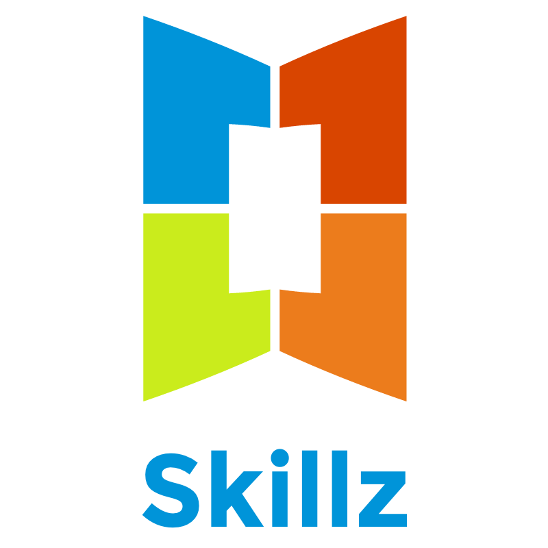

### Kanban board

[](https://waffle.io/xebia-france/xskillz-v2)

### Back

[](https://badge.fury.io/js/npm) [](https://coveralls.io/github/xebia-france/xskillz-v2?branch=master) [](https://travis-ci.org/xebia-france/xskillz-v2)



Skillz allows you to get a full overview of all your team mate's skills.

## License

`Skillz` is licensed under [Apache License](http://www.apache.org/licenses/LICENSE-2.0).

## Quickstart

### Step 0 : Create database workspace

```bash
sudo mkdir -p /opt/skillz/data
sudo chmod 777 /opt/skillz/data
```

### Step 1: Clone this repository

```bash
git clone git@github.com:xebia-france/xskillz-v2.git
cd xskillz-v2
```

### Step 2: Retrieve and build

```bash
cd web
npm i
npm run build
cd ..
docker-compose up --build
```

Have a coffee, it takes some time.

### Step 3 : Enter your skills

Open your browser and go to http://localhost

## Contribute

### Step 1: Clone this repository

```bash
git clone git@github.com:xebia-france/xskillz-v2.git
cd xskillz-v2
```

### Step 2:

### Web application

```bash
cd web/
npm i
npm start
```

### Back end + database

```
docker-compose up db
```

```
cd back/
npm i
npm run dev
```

## Technology inside

* NodeJS
* React
* Docker
* MySQL

Thanks to all those Open source projects which made such a project possible!
